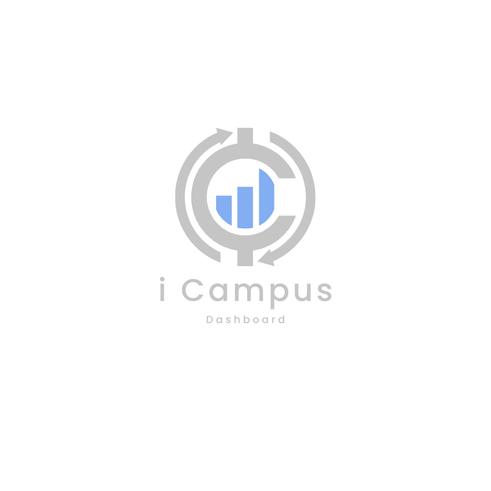
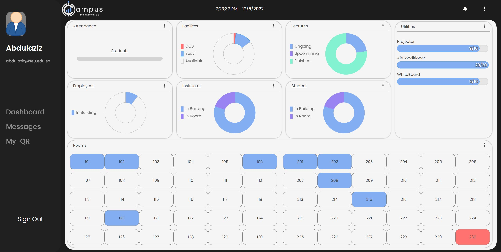
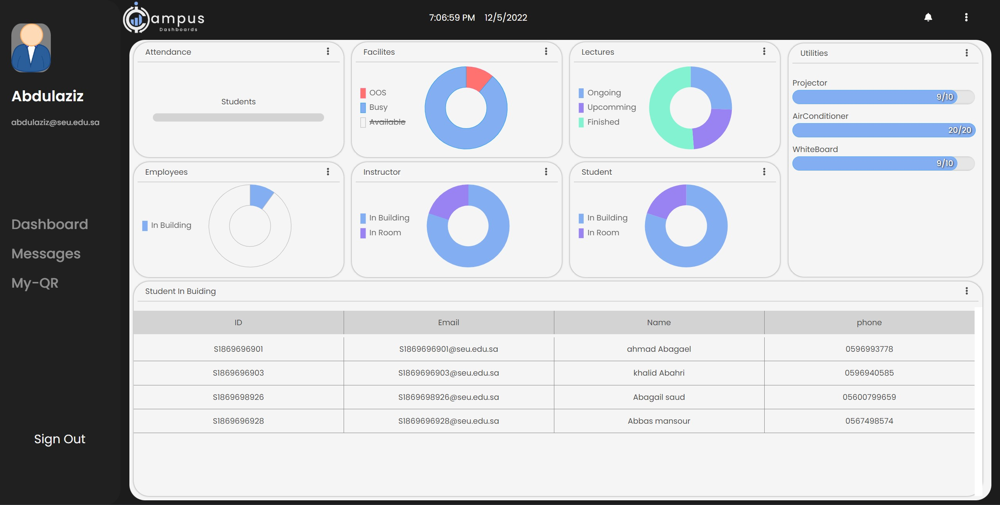
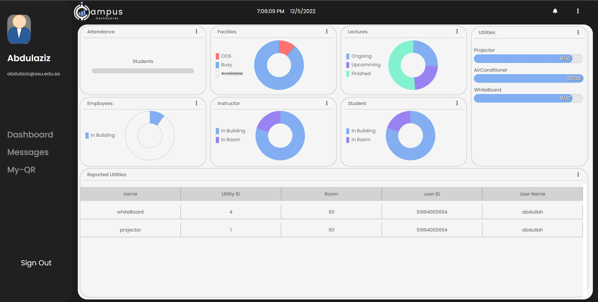
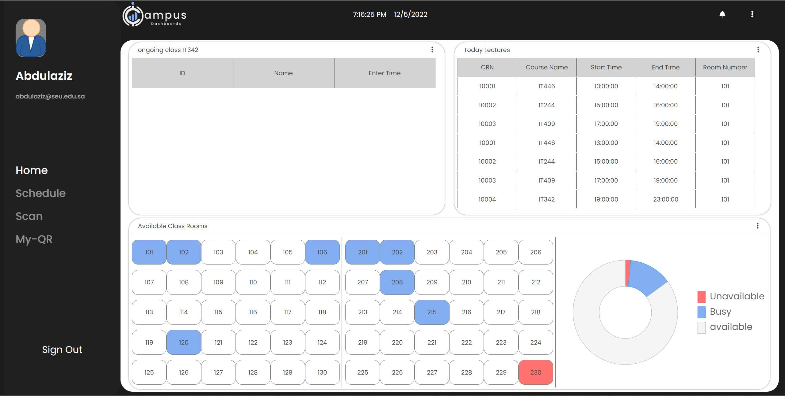
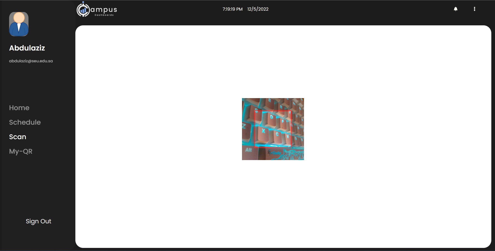
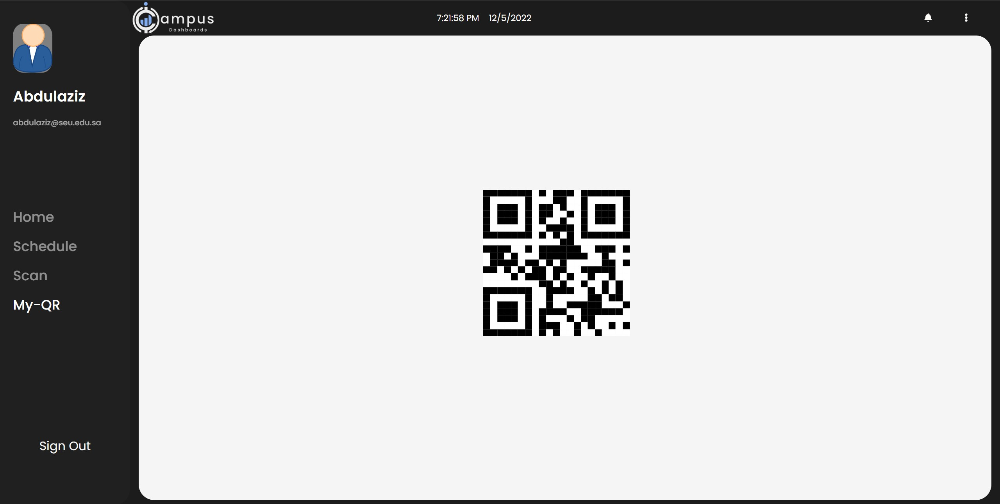

# iCampus

My bachelor senior project (prototype); iCampus is a real-time connection system (web-app)
 where campus managers can monitor the state of all campus's Facilities & utilities,
 number and list of people inside each facility, and attendance ratio; Instructors can reserve a classrooms,
 gets daily schedual, and get instant list of attended student for each class; All users have thier own QR code and can report any facility to the campus managers.
 
## Main Technologies Used

- ReactJS
- ChartJS
- NodeJS - ExpressJS
- MySQL
- Axios
- Socket.io
- JWT


## Run Locally

To run this project locally make sure to have NodeJS and MySQL server ready on your system.

Clone this repo:
```bash
  git clone https://github.com/Rayanba/i-campus.git
```
To install front-end & back-end packeges from packege.json files simply run the following command in Client/c-icampus & server/icampus folders:
```bash
  npm install 
```
To start the back-end server run: 
```bash
  npm run dev
```
to start the front-end server run: 
```bash
  npm start
```
Finally, to install the Database import /Database/icmapus.sql file to you empty Table.

Or you can build the tables using commands in Database/DATABASESCHEMA.SQL file, then insert data using the commands inside the files (each named by the table name ) in Database folder.

*NOTE* 
- all users default password is: password
- add you own .env file and give hashed values for (ACCESS_TOKEN_SECRET, REFRESH_TOKEN_SECRET), and Database values for (DATABASE_HOST, DATABASE_USER, DATABASE_PWD, DATABASE_NAME).
## Screenshots
Admin Dashboard




Instructors Home Page


All users QR-code scanners for Attends, Report and reserve calssroom ( reserving only for instructors)


All users QR-code ID (to enter the campus thoughout the gate)

